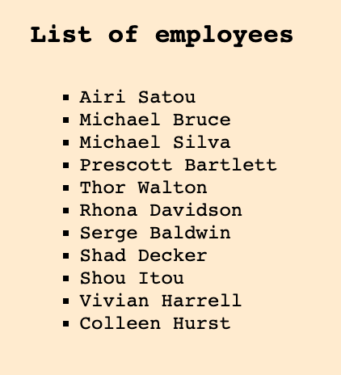
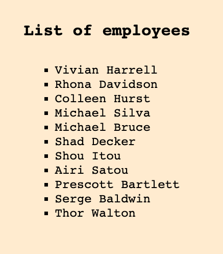

1. Replace `<your_account>` with your Github username in the link
    - [DEMO LINK](https://kostyasabada.github.io/js_task_parse_list_DOM/)
2. Follow [this instructions](https://mate-academy.github.io/layout_task-guideline/)
    - There are no tests for this task so use `npm run lint` command instead of `npm test` 

### Task: Parse list with data attributes

Hey there! Can you parse data from the list and sort it based on data attributes?

Your task: Sort list by salary. Get an array of employees.
Write two functions, first, which sorts the list by salary from data attributes, and the second, which returns an array of objects, where objects are employees.

The schema for the employee:
```
{
  name, 
  position,
  salary,
  age
}
```

It's the list:



It's an expected result of your job:



You can read about non-standard attributes and dataset [here](https://javascript.info/dom-attributes-and-properties#non-standard-attributes-dataset)

##### Steps to do this challenge:
1) Find and get a list from the document.
2) Create function `sortList`, which takes a `list` property, and sort list items by salary from data attribute. (Salary from data attribute is a string, do not forget to convert it to number, write helper function for it). Append sorted items to list.
3) Create function `getEmployees`, which takes a `list` property, and returns an array of right objects.
4) Call both functions.
5) Done.

You no need to change styles or HTML layout in this task. Change only `main.js` file.
