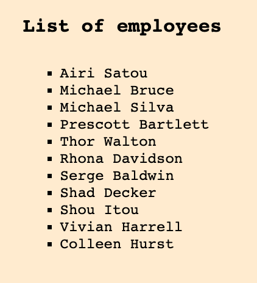
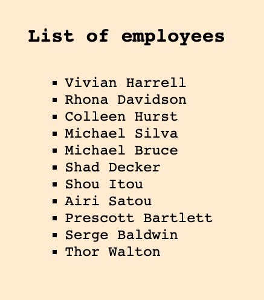

1. Replace `<your_account>` with your Github username in the link
    - [DEMO LINK](https://ElinaMrachkovska.github.io/js_task_parse_list_DOM/)
2. Follow [this instructions](https://mate-academy.github.io/layout_task-guideline/)
    - Run `npm run test` command to test your code;
    - Run `npm run test:only -- -n` to run fast test ignoring linter;
    - Run `npm run test:only -- -l` to run fast test with additional info in console ignoring linter.

### Task: Parse list with data attributes

Hey there! Can you parse data from the list and sort it based on data attributes?

Your task: Sort list by salary in descending order.
Get an array of employees. Write two functions: 
- first, which sorts the list by salary from data attributes
- second, which returns an array of objects, where objects are employees.

The schema for the employee:
```
{
  name, 
  position,
  salary,
  age
}
```

Employees list:



Expected result after soring:



You can read about non-standard attributes and dataset [here](https://javascript.info/dom-attributes-and-properties#non-standard-attributes-dataset)

##### Steps to do this challenge:
1) Find and get a list from the document.
2) Create function `sortList`, which takes a `list` property, and sorts list items in descending order by salary from data attribute. (Salary from data attribute is a string, do not forget to convert it to number, write helper function for it). Append sorted items to list.
3) Create function `getEmployees`, which takes a `list` property, and returns an array of right objects.
4) Call both functions.
5) Done.


Привіт! Чи можете ви розібрати дані зі списку та відсортувати їх на основі атрибутів даних?

Ваше завдання: Сортувати список за зарплатою в порядку спадання.
Отримати масив співробітників. Напишіть дві функції:
- перша, яка сортує список за зарплатою на основі атрибутів даних
- друга, яка повертає масив об'єктів, де об'єкти - це співробітники.

Схема для співробітника:
```
{
ім'я,
посада,
зарплата,
вік
}
```

Список співробітників:


Очікуваний результат після сортування:


Ви можете прочитати про нестандартні атрибути та набір даних [тут](https://javascript.info/dom-attributes-and-properties#non-standard-attributes-dataset)

##### Кроки для виконання цього завдання:

1) Знайдіть та отримайте список з документа.
2) Створіть функцію `sortList`, яка приймає властивість `list` та сортує елементи списку у порядку спадання за зарплатою з атрибута даних. (Зарплата з атрибута даних – це рядок, не забудьте перетворити його на число, напишіть для нього допоміжну функцію). Додайте відсортовані елементи до списку.

3) Створіть функцію `getEmployees`, яка приймає властивість `list` та повертає масив потрібних об'єктів.

4) Викличте обидві функції.

5) Готово.

You don't need to change styles or HTML layout in this task. Change only `main.js` file.
